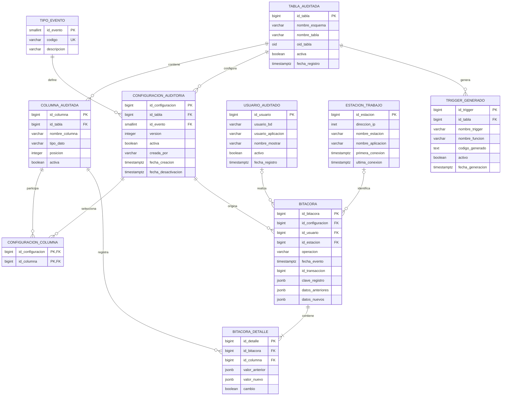

# Diagrama entidad-relación de AutoAudit

El siguiente diagrama muestra las entidades principales del sistema y la forma en que se relacionan.

```mermaid
erDiagram
    TABLA_AUDITADA {
        bigint id_tabla PK
        varchar nombre_esquema
        varchar nombre_tabla
        oid oid_tabla
        boolean activa
        timestamptz fecha_registro
    }

    COLUMNA_AUDITADA {
        bigint id_columna PK
        bigint id_tabla FK
        varchar nombre_columna
        varchar tipo_dato
        integer posicion
        boolean activa
    }

    TIPO_EVENTO {
        smallint id_evento PK
        varchar codigo UK
        varchar descripcion
    }

    CONFIGURACION_AUDITORIA {
        bigint id_configuracion PK
        bigint id_tabla FK
        smallint id_evento FK
        integer version
        boolean activa
        varchar creada_por
        timestamptz fecha_creacion
        timestamptz fecha_desactivacion
    }

    CONFIGURACION_COLUMNA {
        bigint id_configuracion PK,FK
        bigint id_columna PK,FK
    }

    USUARIO_AUDITADO {
        bigint id_usuario PK
        varchar usuario_bd
        varchar usuario_aplicacion
        varchar nombre_mostrar
        boolean activo
        timestamptz fecha_registro
    }

    ESTACION_TRABAJO {
        bigint id_estacion PK
        inet direccion_ip
        varchar nombre_estacion
        varchar nombre_aplicacion
        timestamptz primera_conexion
        timestamptz ultima_conexion
    }

    BITACORA {
        bigint id_bitacora PK
        bigint id_configuracion FK
        bigint id_usuario FK
        bigint id_estacion FK
        varchar operacion
        timestamptz fecha_evento
        bigint id_transaccion
        jsonb clave_registro
        jsonb datos_anteriores
        jsonb datos_nuevos
    }

    BITACORA_DETALLE {
        bigint id_detalle PK
        bigint id_bitacora FK
        bigint id_columna FK
        jsonb valor_anterior
        jsonb valor_nuevo
        boolean cambio
    }

    TRIGGER_GENERADO {
        bigint id_trigger PK
        bigint id_tabla FK
        varchar nombre_trigger
        varchar nombre_funcion
        text codigo_generado
        boolean activo
        timestamptz fecha_generacion
    }

    TABLA_AUDITADA ||--o{ COLUMNA_AUDITADA : contiene
    TABLA_AUDITADA ||--o{ CONFIGURACION_AUDITORIA : configura
    TIPO_EVENTO ||--o{ CONFIGURACION_AUDITORIA : define
    CONFIGURACION_AUDITORIA ||--o{ CONFIGURACION_COLUMNA : selecciona
    COLUMNA_AUDITADA ||--o{ CONFIGURACION_COLUMNA : participa
    CONFIGURACION_AUDITORIA ||--o{ BITACORA : origina
    USUARIO_AUDITADO o|--o{ BITACORA : realiza
    ESTACION_TRABAJO o|--o{ BITACORA : identifica
    BITACORA ||--|{ BITACORA_DETALLE : contiene
    COLUMNA_AUDITADA ||--o{ BITACORA_DETALLE : registra
    TABLA_AUDITADA ||--o{ TRIGGER_GENERADO : genera
```
